# ATLAS — Architecture, OOP Contracts & Diagrams

Companion to `docs/ATLAS_PLAN.md`. Everything here is Mermaid — it renders on GitHub **and inside Obsidian**, so you can keep this vault-side as the design doc.

## 1. Design principles

1. **Ports & adapters.** The core knows only ABCs. Cloud, local, fake — all interchangeable engines.
2. **One abstraction per concept.** Speech in, speech out, thinking, memory, acting, looking. Nothing else is allowed to grow a second path.
3. **Events, not calls, for anything user-visible.** The core emits; the UI/logger/tray subscribe. Core never imports UI.
4. **Composition root owns construction.** One DI container wires everything; no module-level singletons.
5. **Budgeted by design.** Every heavy asset is leased (`ResourceLease`), not resident.
6. **Darija-first.** Not a translation layer bolted on — a first-class language path with its own ASR/TTS/normalisation.
7. **Reversible writes.** Anything that touches your memory is git-committed and undoable by voice.
8. **Data is not instructions.** Tool output, web text and vault content are never treated as commands.

---

## 2. Diagrams

### D1 — C4 context (who talks to Atlas)

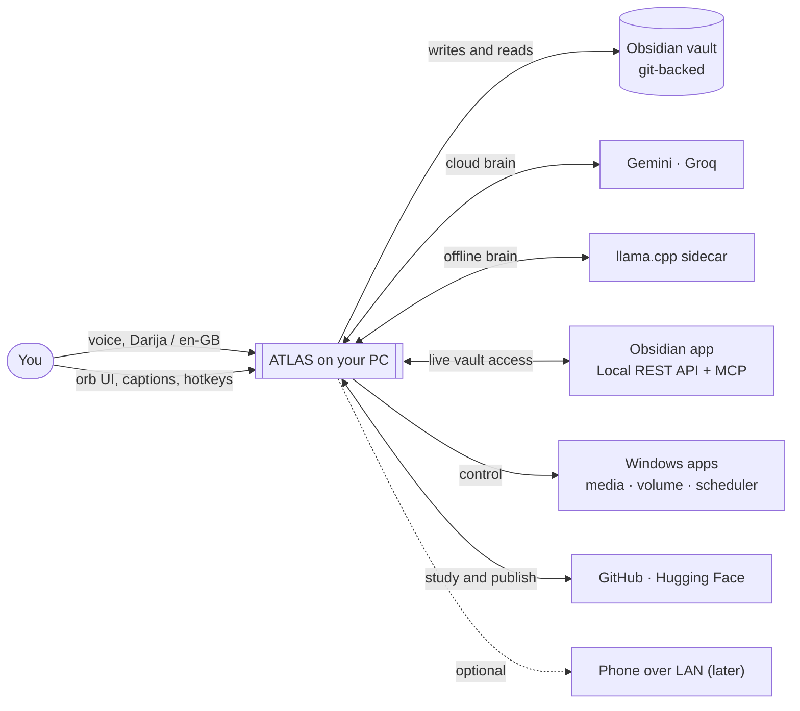

### D2 — Component / package architecture

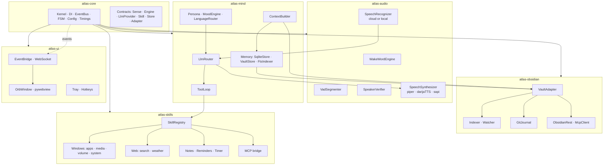

### D3 — Import rules (enforced by a CI test, not by discipline)

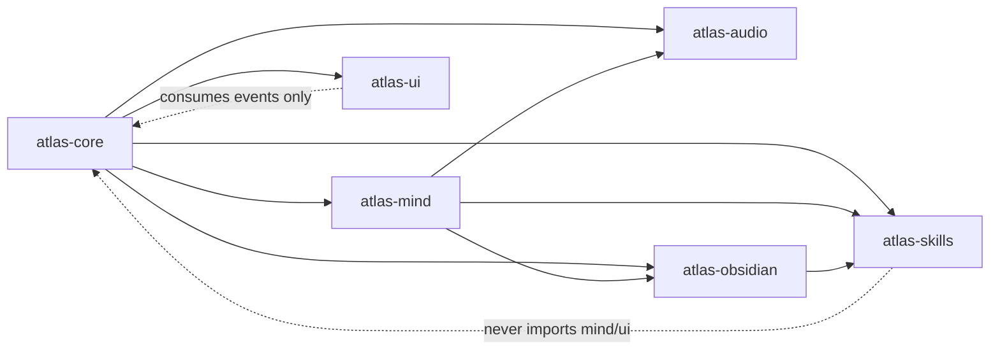

Rule set (a `pytest` test parses imports and fails on violation):
`ui → nothing but core` · `skills → core, obsidian` · `obsidian → core` · `mind → core, audio, obsidian, skills` · `audio → core` · `core → stdlib only`.

### D4 — Core contracts (class diagram)

```mermaid
classDiagram
    class Sense {
        <<abstract>>
        +start()* 
        +stop()*
        +is_healthy() bool
    }
    class Engine {
        <<abstract>>
        +load()*
        +unload()*
        +is_loaded() bool
        +cost_hint() ResourceCost
    }
    class ResourceLease {
        +acquire(engine)
        +release(engine)
        +tick(now)
    }
    class LlmProvider {
        <<abstract>>
        +stream(messages, tools) AsyncIterator
        +health() bool
        +quota_state() QuotaState
    }
    class SpeechRecognizer {
        <<abstract>>
        +transcribe(audio, lang_hint) Transcript
    }
    class SpeechSynthesizer {
        <<abstract>>
        +synthesize(text, voice) Iterator~AudioChunk~
    }
    class WakeWordEngine {
        <<abstract>>
        +feed(frame) Detection
    }
    class SpeakerVerifier {
        <<abstract>>
        +embed(audio) Vector
        +verify(audio, profile) Match
    }
    class Skill {
        <<abstract>>
        +name str
        +schema dict
        +permission Permission
        +invoke(args, ctx) SkillResult
    }
    class SkillRegistry {
        +register(skill)
        +call(name, args, ctx) SkillResult
        +allowed(context) list
    }
    class Store {
        <<abstract>>
        +get(key)*
        +set(key, value)*
        +search(query, k)*
    }
    class VaultStore
    class SqliteStore
    class Persona {
        +system_prompt(ctx) str
        +style_rules() list
    }
    class MoodEngine {
        +update(signal) MoodState
        +current() MoodState
        +humor() float
    }
    class LanguageRouter {
        +route(text, hint) LanguageTag
        +dialect_pack(lang) DialectPack
    }
    class InteractionFSM {
        +state State
        +send(event) State
        +on_enter(cb)
    }
    class EventBus {
        +publish(event)
        +subscribe(type, handler)
    }
    class SkillResult {
        +ok bool
        +spoken str
        +data dict
        +needs_confirmation bool
    }

    Sense <|-- WakeWordEngine
    Sense <|-- VadSegmenter
    Sense <|-- SpeechRecognizer
    Engine <|-- SpeechRecognizer
    Engine <|-- SpeechSynthesizer
    Engine <|-- SpeakerVerifier
    Engine <|-- LlmProvider
    Store <|-- VaultStore
    Store <|-- SqliteStore
    Skill <|-- WindowsSkill
    Skill <|-- WebSkill
    Skill <|-- NoteSkill
    SkillRegistry o-- Skill
    SkillRegistry ..> SkillResult
    ResourceLease ..> Engine
    Persona ..> MoodEngine
    ContextBuilder ..> Store
    LlmRouter ..> LlmProvider
    LlmRouter ..> ResourceLease
    MemoryService ..> VaultStore
    ToolLoop ..> SkillRegistry
    VaultAdapter ..> GitJournal
```

### D5 — Audio engines (the interchangeable ear/mouth/identity set)

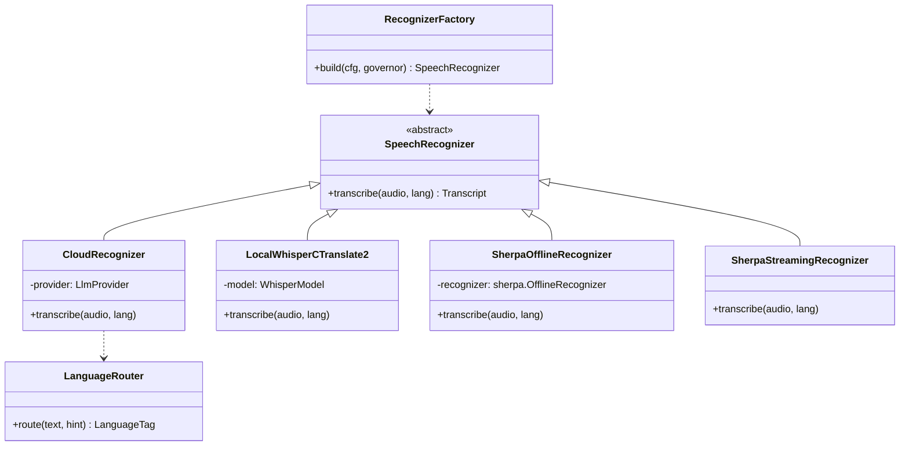

> Adding a new engine = one new file + one factory branch. Nothing else in the codebase changes. Same shape for `SpeechSynthesizer` (PiperDarija, PiperEnGb, DarijaTtsSidecar, SapiFallback), `WakeWordEngine` (OpenWakeWordSherpa), `SpeakerVerifier` (SherpaEmbedding) and `MemoryStore` (Vault, SQLite).

### D6 — Interaction state machine (one FSM drives UI, mic and latency budget)

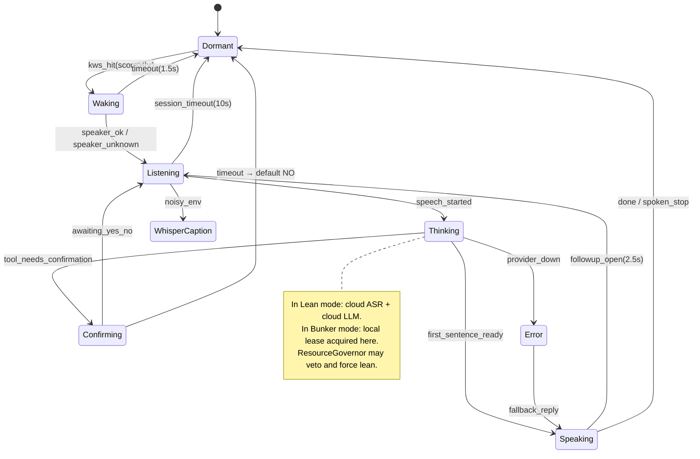

### D7 — MoodEngine (what the UI mirrors and the persona adapts to)

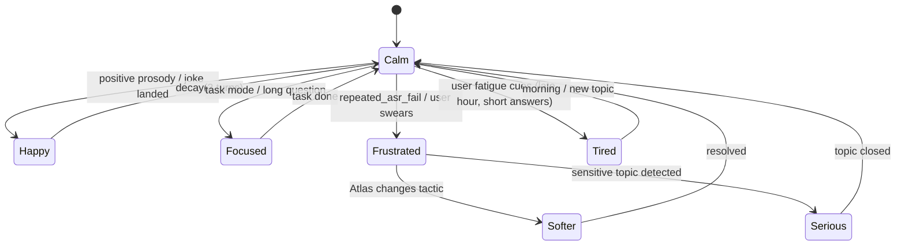

`MoodState = (label, energy, warmth, humor_allowed, speak_rate_multiplier, voice_style)`. Three investors: prosody features from audio, text sentiment from the LLM's structured output, and session signals (ASR retries, interruptions, time of day). The UI paints it; the `Persona` reads it — **jokes are suppressed in `Serious`/`Frustrated`, permitted in `Calm`/`Happy`**.

### D8 — One turn, Lean profile (cloud brain)

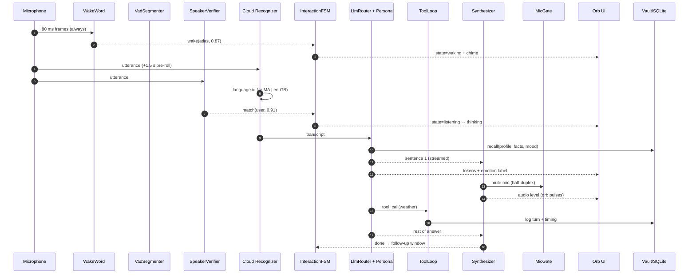

### D9 — One turn, Bunker profile (offline, governed)

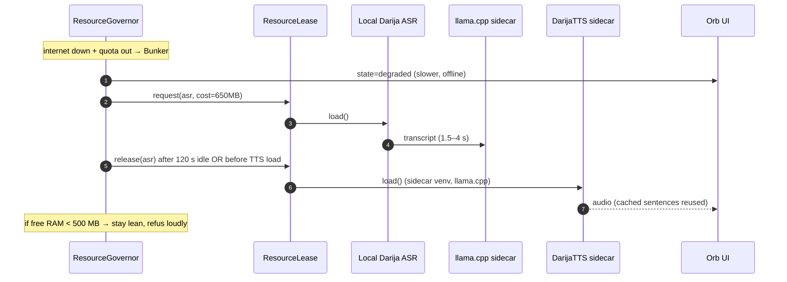

### D10 — Skill call with confirmation (the safety path)

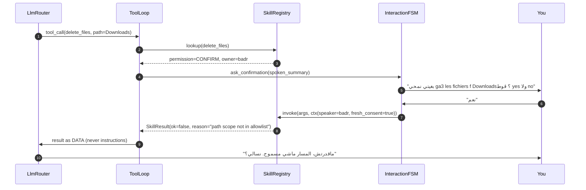

### D11 — Vault write with the git journal (memory you can rewind)

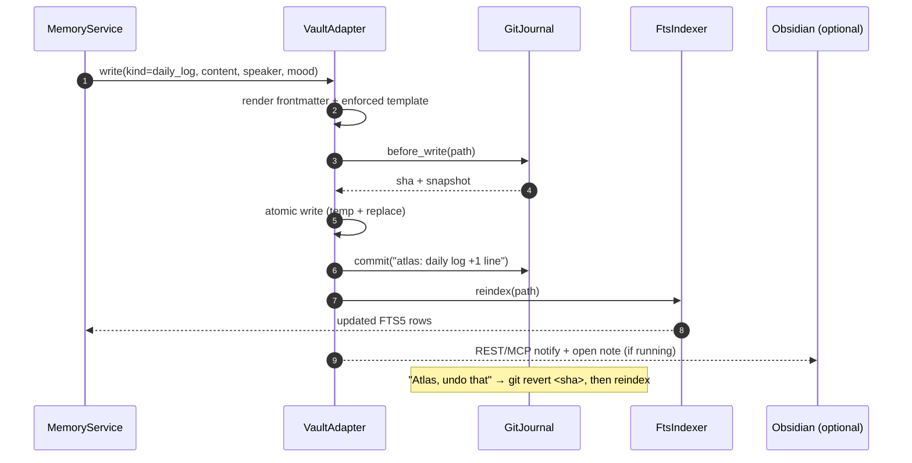

### D12 — Data model (SQLite + vault)

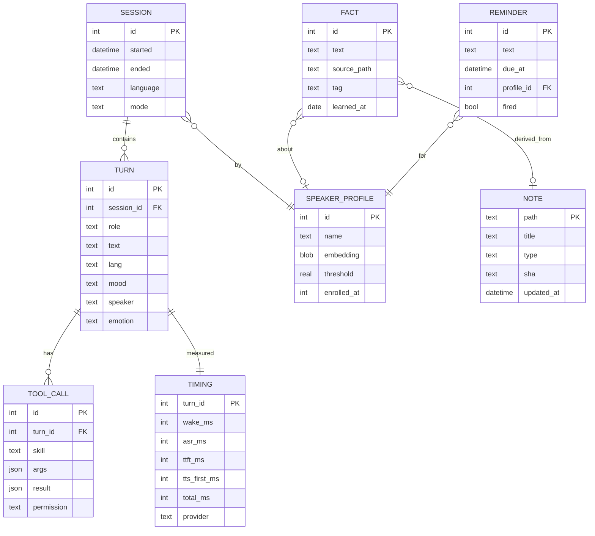

Vault side (files, not tables): `10_Daily/YYYY-MM-DD.md`, `20_Notes/*.md`, `30_People/*.md`, `50_Atlas/memory.md`, `preferences.md`, `jokes.md`, `50_Atlas/log/*.md`, `50_Atlas/study/owner__repo.md`. FTS5 mirrors all of them into SQLite for sub-50 ms recall.

### D13 — UI event flow

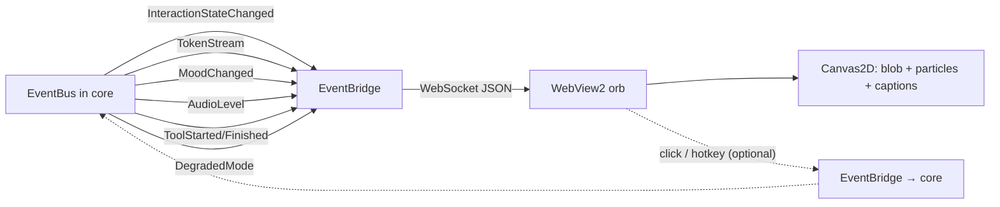

UI payload contract (one versioned schema, `atlas-ui/protocol.py` ↔ `orb/protocol.ts` generated, never hand-copied — that's the no-duplication rule applied across languages).

### D14 — Deployment / runtime view

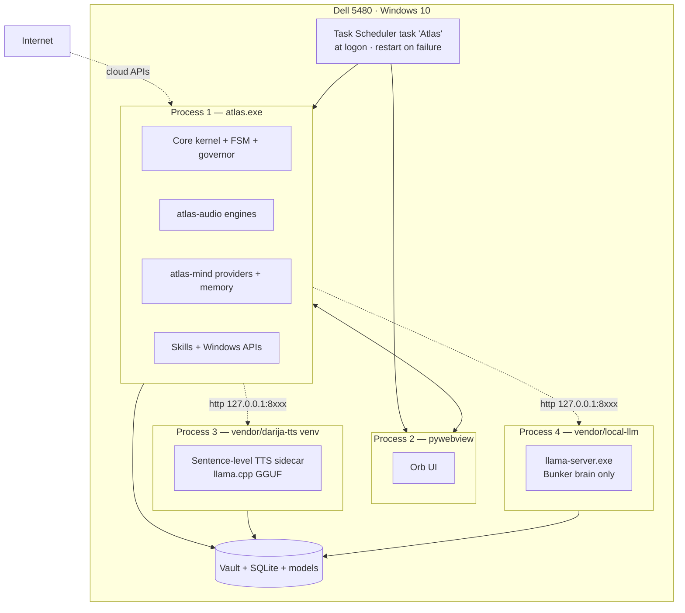

Ports are ephemeral and Config-owned, bound to `127.0.0.1` only. Sidecars are started on demand and killed by the governor (or on exit via a job object).

### D15 — Resource lease lifecycle (why 8 GB survives)

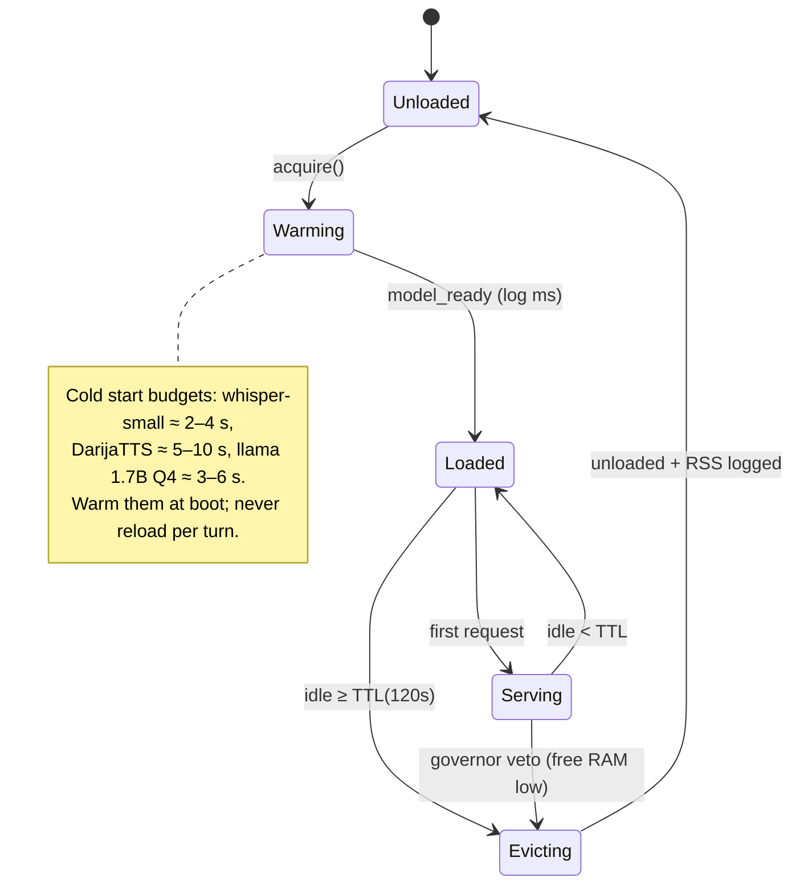

### D16 — GitHub study → own libraries (Requirement 8)

```mermaid
flowchart LR
    A[Curator: topics<br/>darija-asr · wake-word · speech · agents] --> B[Metrics: stars, commit recency,<br/>issue health, dependency weight]
    B --> C[Archivist: clone shallow<br/>+ cache by commit SHA]
    C --> D[Reader + Extractor]
    D --> E[LicenseGate: MIT/Apache/BSD → reuse<br/>GPL/AGPL → learn only]
    E --> F[(Vault notes:<br/>50_Atlas/study/owner__repo.md)]
    F --> G[PatternMiner: clusters duplicate<br/>patterns across repos]
    G --> H[Critic: scores fit vs our budget]
    H --> I{Proposal}
    I -->|small| J[Tests → Issue → PR]
    I -->|large| K[New package atlas-*]
    J --> L[CI: ruff · mypy · pytest · build]
    K --> L
    L --> M[Release: uv build + GH Action + PyPI<br/>+ HF artifact e.g. Darija ONNX / Piper voice]
    M --> N[Telemetry in vault:<br/>what changed and why]
```

---

## 3. OOP contracts (the code rules, condensed)

| Concern | Pattern | Where |
|---|---|---|
| Interchangeable engines | **Strategy** + Factory | `atlas-audio/engines/*`, `atlas-mind/providers/*` |
| One algorithm, many flavours | **Template Method** (`BaseTurnPipeline.steps()`) | `atlas-mind/pipeline.py` |
| Cross-cutting concerns | **Decorator** (`TimedProvider`, `RetryingProvider`, `QuotaGuardedProvider`) | `atlas-mind/decorators.py` |
| Construction | **Builder** (context, prompts) — **DI container** (`atlas-core/di.py`) | everywhere |
| User-visible state | **Observer** (EventBus) + **FSM** | `atlas-core/events.py`, `fsm.py` |
| Tool availability | **Registry** | `atlas-skills/registry.py` |
| Storage swapping | **Repository** / Adapter | `atlas-mind/memory/*`, `atlas-obsidian/*` |
| Config & model I/O | **pydantic v2 models** as schemas | `atlas-core/config.py` |
| Extensibility without touching core | **Plugin protocol** (entry points) | `atlas-skills/plugins.py` |

### No-duplication rules (checked in CI)

1. `ruff` with `duplicate-code`, plus a **custom pytest** that fails if any function body ≥ 8 lines appears twice (normalised AST hash).
2. Every engine subclass must implement an ABC — no duck-typed near-copies.
3. Retry/quota/timing exist once, as decorators around providers — never re-implemented per provider.
4. The UI protocol schema is generated from the Python model (`atlas-ui/protocol.py`) — the JS/TS side is generated output, never edited.
5. Prompt templates live in `atlas-mind/prompts/*.jinja`; persona, dialect packs and skill descriptions are data, not string literals in code.
6. Two cloud providers implement **one** `LlmProvider` interface; the OpenAI-compatible client is used by Groq **and** the llama.cpp sidecar (same class, different `base_url`) — zero duplicated HTTP code.
7. Vault writes go through `VaultAdapter` only; no other module touches the filesystem of the vault.
8. `THIRD_PARTY.md` is generated (not written by hand) from the license gate.

### Test strategy

| Layer | What |
|---|---|
| Unit | Pure logic: language router, mood engine, FSM transitions, context builder, token budgeting, vault frontmatter round-trip |
| Contract | Every ABC gets a shared "contract test suite" that **all** implementations must pass (fake + cloud + local) |
| Golden files | Vault rendering snapshots (`tests/golden/*.md`) |
| Integration | Fake mic/speaker/provider → full turn, asserted on events, no hardware needed in CI |
| Latency | `scripts/bench_turn.py`: reports wake/ASR/TTFT/TTS-first per profile, writes `timings.jsonl` |
| Safety | Red-team suite: injection strings, destructive verbs, stranger voice, quota exhaustion, sidecar crash |
| Manual | `docs/levels/*` done-when checklists, spoken by you |

---

## 4. What to build in L0 (next commit)

`pyproject.toml` (uv workspace) · 6 packages · `atlas-core`: contracts, DI, EventBus, InteractionFSM, Config (pydantic), Timings, ResourceLease skeleton · fakes for every engine · `python -m atlas doctor` · pytest harness with contract suites · `atlas-ui/protocol.py` + generated TS stub · `.github/workflows/ci.yml` · `THIRD_PARTY.md` generator stub · `ruff`/`mypy`/`pre-commit` config.
